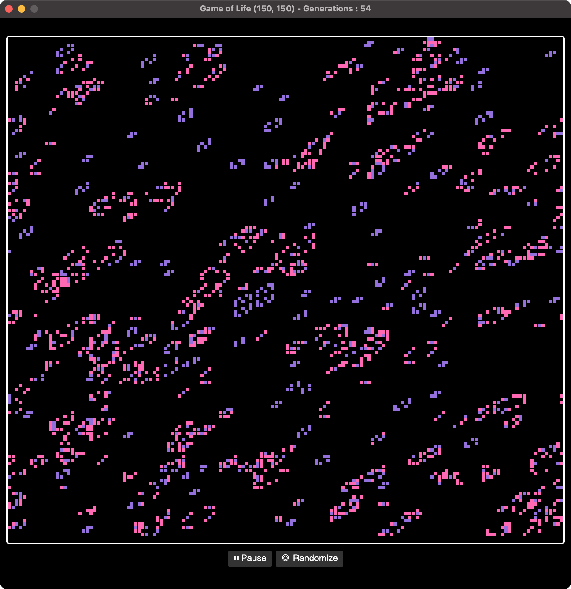

# Conway's Game of Life with AvaloniaUI

This repository has an implementation of Conway's Game of Life using Avalonia UI.

## Getting Started

You'll need .NET 7 SDK, and then use `dotnet run`.

## Why?

This project started by optimizing JetBrains dotMemory tutorial game of life, which is currently written in WPF. This makes it difficult for folks to run on macOS. I realized quickly that the WPF implementation was not going to work with Avalonia based on the original implementation. So, I decided to rewrite the project using CommunityToolkit and MVVM and optimize it as much as I could. There's still some room for improvement, specifically around the dispatching of updating events.

The biggest grid I could get running was 250^2 before things started to get slow. See if you can do better.

## Contact me

If you'd like to chat about this implementation, you can reach me at this repo or on Mastodon at @khalidabuhakmeh@mastodon.social.